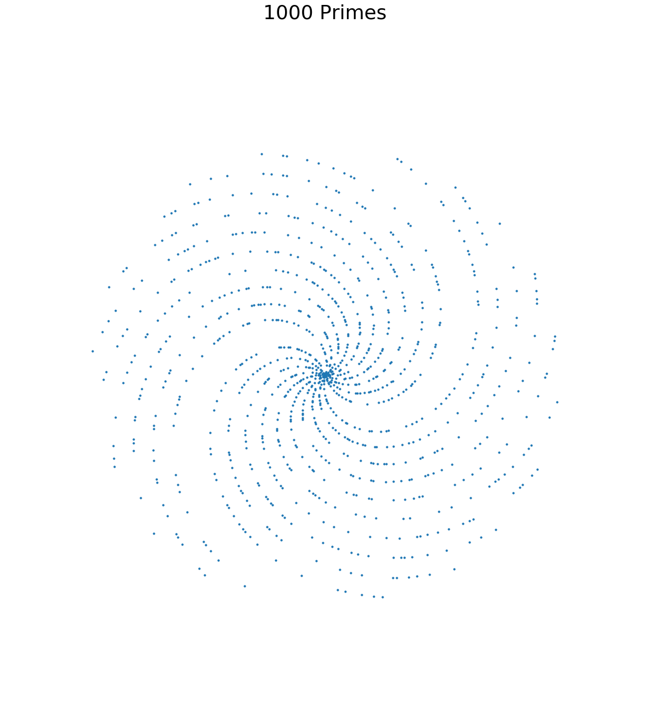

# Plotting Primes

## This fun project and playing with primes was insprired by 3Blue1Brown's video on youtube.

**3Blue1Brown is a brilliant youtube channel on mathematics
Here is the link for the video: https://www.youtube.com/watch?v=EK32jo7i5LQ**

**This code replicates the distribution of prime numbers plot in a polar co-ordinate system seen in the video.
You can plot the first n prime numbers. Here there is only one input defined by the variable num.**

## How to
*  File1
*  File2

## Plots

